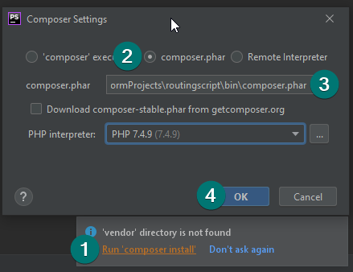

# Routingscript MVC

little routing script for use in DBWT

intended to run with only one dependency (bladeone).

## usage

* start this script by either executing `start_server.bat` or running `php -S 127.0.0.1:9001 -t public` in a shell from the project´s root directory.

* [open the website](http://127.0.0.1:9001/)

## prerequisites

* PHP 7.4 or PHP 8.0

after first importing into PhpStorm, the IDE will present you the following dialog. there you can select a composer executable (find it in `bin/composer.phar`) 

or run `php bin/composer.phar update` in the terminal.

